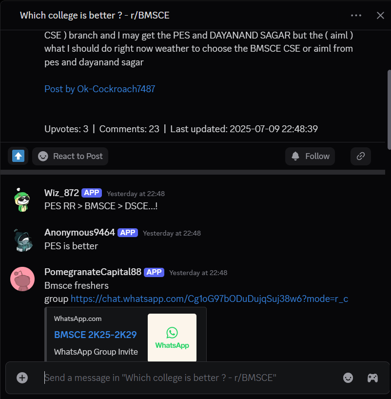

Markdown

# 🤖 Reddit Discord Sync
A powerful Discord bot cog that automatically fetches top posts and comments from selected Reddit subreddits and posts them into a Discord **Forum Channel** using webhooks.
Simulates Reddit user behavior by retrieving top-level comments and embedding them seamlessly in the forum thread

---

## 📌 Features

- 🔄 Scheduled Reddit post fetching (hourly or configurable)
- 💬 Automatically posts top comments from Reddit threads
- 🧵 Creates dedicated threads in Discord Forum channels
- 🧹 Daily cleanup of webhooks to reduce clutter
- 🔒 Uses `.env` for credentials — safe & secure
- 🧠 Mimics a real Reddit user by fetching and posting top comments naturally into the thread

---

## 🚀 Getting Started

### 1. Clone the Repository

```bash
git clone https://github.com/notrishi-1/Reddit-discord-sync.git
cd reddit-forum-bot
```
### 2. Install Requirements

```bash
pip install -r requirements.txt
```
### 3. Create Your .env File
Use the provided .env.sample as a guide:

Code snippet
```bash
REDDIT_CLIENT_ID=your_reddit_client_id
REDDIT_CLIENT_SECRET=your_reddit_client_secret
REDDIT_USER_AGENT=your_user_agent
DISCORD_TOKEN=your_discord_bot_token
DISCORD_FORUM_CHANNEL_ID=123456789012345678
```

### 4. Run the Bot
```bash
python cog-runner.py
```

🗂️ Project Structure
```
reddit-discord-sync/
├── reddit-cog.py
├── cog-runner.py               # Entry point
├── .env                        # Secrets (not committed)
├── .env.sample                 # Sample env file
├── requirements.txt            # Python dependencies
├── .gitignore                  # Files to exclude from git
├── LICENSE                     # MIT License
└── README.md                   # You’re reading it!
```

⚙️ Configuration
Inside reddit-cog.py, you can adjust:

| Variable                     | Purpose                             |
| ---------------------------- | ----------------------------------- |
| `PRIMARY_SUBREDDIT`          | Main subreddit for frequent polling |
| `ALTERNATE_SUBREDDIT`        | Additional subreddits               |
| `PRIMARY_POST_FREQUENCY`     | Interval (in hours) for main sub    |
| `ALTERNATE_POST_FREQUENCY`   | Interval for alternate subs         |
| `PRIMARY_FREQUENCY_PER_POST` | Number of top posts to fetch        |


## 📸 Example Screenshot

Below is a preview of how Reddit posts and comments appear in the Discord Forum Channel:




🛠️ Built With
```
discord.py

asyncpraw

python-dotenv

Reddit API

Discord Webhooks
```

📄 License
This project is licensed under the MIT License. See LICENSE for details.
